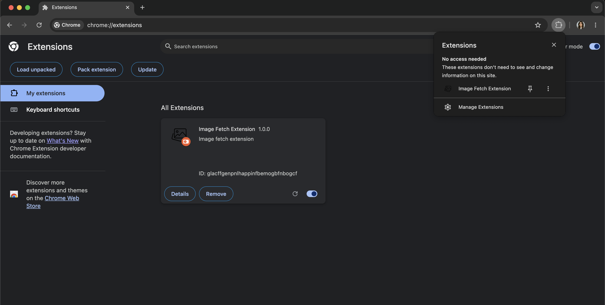
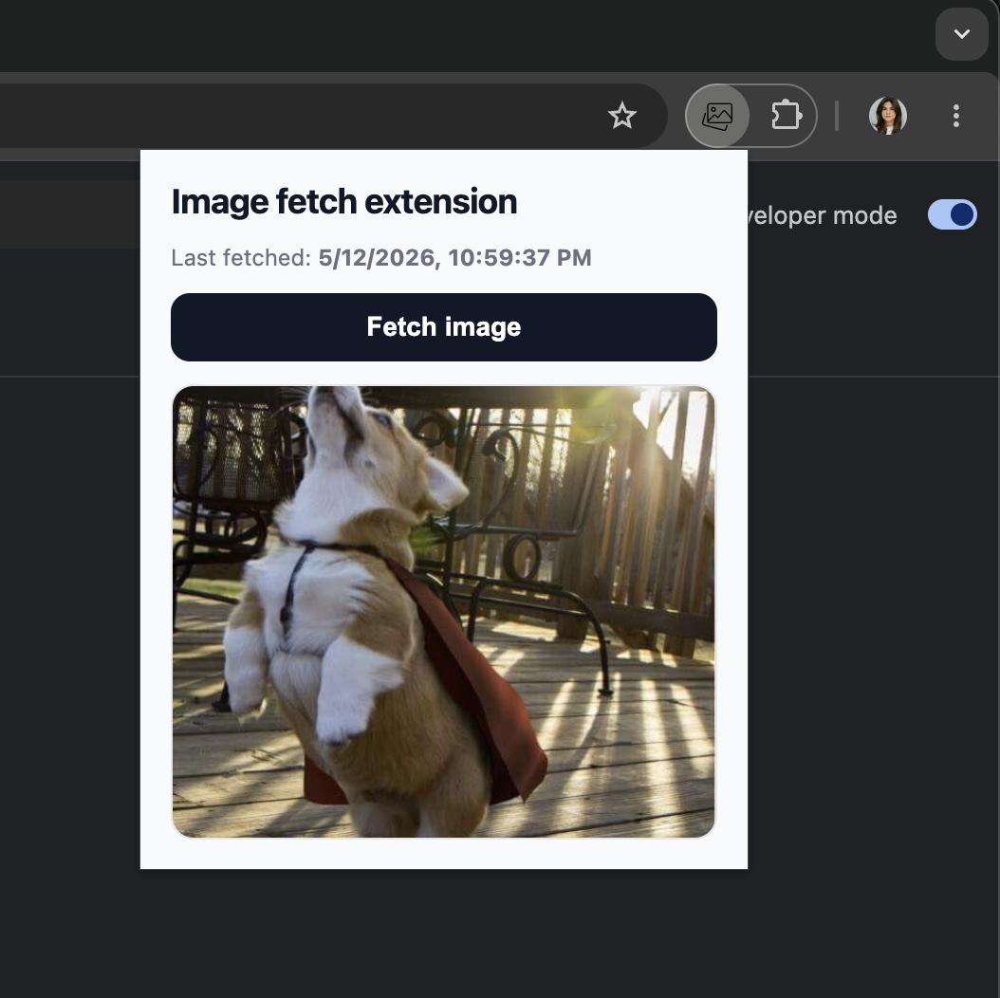

# Image Fetch Extension
 
A simple Chrome extension that fetches a random image from a public API at the click of a button. Built with **React**, **TypeScript** and **Vite**.
 
## Features
 
- Popup UI rendered with React
- Fetches a random image from a public API on button click
- Displays the timestamp of the last successful fetch
- Built using Manifest V3
## Tech Stack
 
- **React** — UI library
- **TypeScript** — type safety
- **Vite** — build tool and bundler
- **Chrome Extensions API (Manifest V3)**
## Project Structure
 
```
image-fetch-extension/
├── public/
│   └── manifest.json         # Chrome extension manifest (V3)
├── src/
│   ├── App.tsx               # Main popup component
│   ├── main.tsx              # React entry point
│   └── index.css             # Styling
├── index.html                # Popup HTML entry
├── vite.config.ts            # Vite configuration
├── tsconfig.json
└── package.json
```
 
## Getting Started
 
### Prerequisites
 
- [Node.js](https://nodejs.org/) (v18 or newer recommended)
- npm (comes with Node.js)
- Google Chrome
### Installation
 
Clone the repository and install dependencies:
 
```bash
git clone https://github.com/marinadimovska/image-fetch-extension.git
cd image-fetch-extension
npm install
```
 
### Build
 
Build the extension for production:
 
```bash
npm run build
```
 
The bundled extension will be generated in the `dist/` directory.
 
### Development
 
To run the project in development mode with hot reload (browser preview only):
 
```bash
npm run dev
```
 
> Note: For testing inside Chrome, you must run `npm run build` and load the `dist/` folder as an unpacked extension (see below).
 
## Loading the Extension in Chrome
 
1. Run `npm run build` to generate the `dist/` folder.
2. Open Chrome and navigate to `chrome://extensions`.
3. Enable **Developer mode** (toggle in the top-right corner).
4. Click **Load unpacked**.
5. Select the `dist/` folder from the project.
6. The extension icon will appear in your Chrome toolbar.
## Usage
 
1. Click the extension icon in the Chrome toolbar to open the popup.
2. Click the **Fetch image** button.
3. A random image is fetched from the public API and displayed in the popup.
4. The timestamp of the last fetch is shown above the button.
## Screenshots
 
### Extension Loaded in Chrome
 
**
## Project Structure
 
```
image-fetch-extension/
├── public/
│   └── manifest.json         # Chrome extension manifest (V3)
├── src/
│   ├── App.tsx               # Main popup component
│   ├── main.tsx              # React entry point
│   └── index.css             # Styling
├── index.html                # Popup HTML entry
├── vite.config.ts            # Vite configuration
├── tsconfig.json
└── package.json
```
 
## Getting Started
 
### Prerequisites
 
- [Node.js](https://nodejs.org/) (v18 or newer recommended)
- npm (comes with Node.js)
- Google Chrome
### Installation
 
Clone the repository and install dependencies:
 
```bash
git clone https://github.com/marinadimovska/image-fetch-extension.git
cd image-fetch-extension
npm install
```
 
### Build
 
Build the extension for production:
 
```bash
npm run build
```
 
The bundled extension will be generated in the `dist/` directory.
 
### Development
 
To run the project in development mode with hot reload (browser preview only):
 
```bash
npm run dev
```
 
> Note: For testing inside Chrome, you must run `npm run build` and load the `dist/` folder as an unpacked extension (see below).
 
## Loading the Extension in Chrome
 
1. Run `npm run build` to generate the `dist/` folder.
2. Open Chrome and navigate to `chrome://extensions`.
3. Enable **Developer mode** (toggle in the top-right corner).
4. Click **Load unpacked**.
5. Select the `dist/` folder from the project.
6. The extension icon will appear in your Chrome toolbar.
## Usage
 
1. Click the extension icon in the Chrome toolbar to open the popup.
2. Click the **Fetch image** button.
3. A random image is fetched from the public API and displayed in the popup.
4. The timestamp of the last fetch is shown above the button.
## Screenshots
 
### Extension Loaded in Chrome
 
**
## Project Structure
 
```
image-fetch-extension/
├── public/
│   └── manifest.json         # Chrome extension manifest (V3)
├── src/
│   ├── App.tsx               # Main popup component
│   ├── main.tsx              # React entry point
│   └── index.css             # Styling
├── index.html                # Popup HTML entry
├── vite.config.ts            # Vite configuration
├── tsconfig.json
└── package.json
```
 
## Getting Started
 
### Prerequisites
 
- [Node.js](https://nodejs.org/) (v18 or newer recommended)
- npm (comes with Node.js)
- Google Chrome
### Installation
 
Clone the repository and install dependencies:
 
```bash
git clone https://github.com/marinadimovska/image-fetch-extension.git
cd image-fetch-extension
npm install
```
 
### Build
 
Build the extension for production:
 
```bash
npm run build
```
 
The bundled extension will be generated in the `dist/` directory.
 
### Development
 
To run the project in development mode with hot reload (browser preview only):
 
```bash
npm run dev
```
 
> Note: For testing inside Chrome, you must run `npm run build` and load the `dist/` folder as an unpacked extension (see below).
 
## Loading the Extension in Chrome
 
1. Run `npm run build` to generate the `dist/` folder.
2. Open Chrome and navigate to `chrome://extensions`.
3. Enable **Developer mode** (toggle in the top-right corner).
4. Click **Load unpacked**.
5. Select the `dist/` folder from the project.
6. The extension icon will appear in your Chrome toolbar.
## Usage
 
1. Click the extension icon in the Chrome toolbar to open the popup.
2. Click the **Fetch image** button.
3. A random image is fetched from the public API and displayed in the popup.
4. The timestamp of the last fetch is shown above the button.
## Screenshots
 
### Extension Loaded in Chrome
 

 
### Popup in Action
 

 
## API
 
This extension uses a public image API (e.g. [Dog CEO API](https://dog.ceo/dog-api/)) to fetch random images. The API is called directly from the popup using the native `fetch` API — no API key required.
 
## Author
 
**Marina Dimovska**
 
## License
 
This project is created as part of an assignment and is provided for educational purposes.
